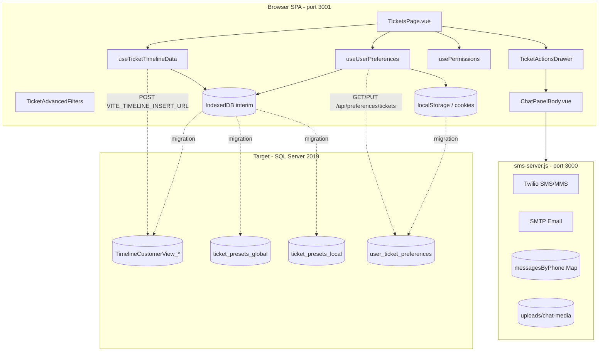
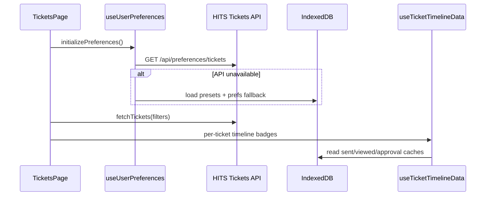
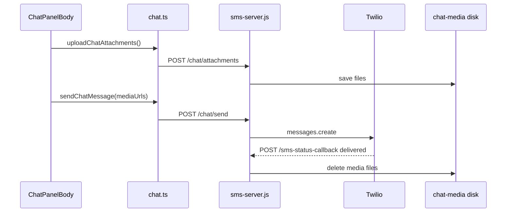
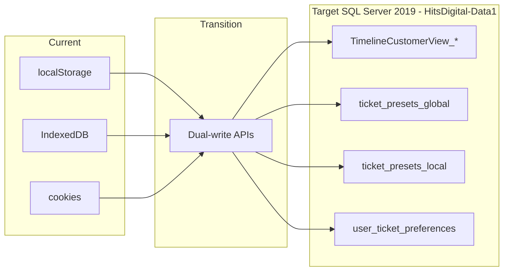

# Customer Care — Implementation Guide

**Audience:** Backend developers (DB + API) and frontend developers (Vue)  
**Scope:** Tickets (`/`, `/tickets`) and Chat/SMS (`sms-server.js`)  
**Target database:** Microsoft SQL Server 2019  
**Last updated:** 2026-05-29

---

## 1. Overview

Customer Care is a Vue 3 + TypeScript SPA (Vite, port **3001**) for shop staff to manage repair tickets: list/filter, presets, timeline, permissions, and customer chat (SMS/email via a Node server on port **3000**).

Ticket data is read from the existing HITS/POS API (out of scope for this doc). **New persistence** in this project focuses on:

- Timeline events (sent, viewed, status, approvals, inspection events)
- Ticket filter presets (global + account-local)
- Per-user ticket UI preferences
- Chat transport (Twilio/SMTP; durable storage deferred)

### 1.1 Module diagram



### 1.2 Persistence phases

| Phase | State | Authority |
|-------|--------|-----------|
| **Current** | IndexedDB + localStorage + cookies; optional timeline POST | Browser |
| **Transition** | Dual-write to SQL Server + read from API | Hybrid |
| **Target** | SQL Server authoritative; browser cache optional | Server |

---

## 2. Routes and key files

### 2.1 Vue routes (tickets scope)

| Route | Component | Purpose |
|-------|-----------|---------|
| `/`, `/tickets` | `TicketsPage.vue` | Main ticket list (card/table/progress) |
| *(drawer, not routed)* | `TicketActionsDrawer.vue` | Chat, timeline, approvals, worksheet tabs |

Defined in `src/main.ts`.

### 2.2 Key composables and libs

| Module | Role |
|--------|------|
| `useUserPreferences.ts` | Filters, style, presets; API + IndexedDB/localStorage |
| `usePermissions.ts` | `permission_cost`, `permission_Chat`, `HDN1`, `HDN2` |
| `useTicketTimelineData.ts` | Aggregates timeline UI data per ticket |
| `useViewButtonState.ts` | Invoice “viewed” button flash state (client-only UX) |
| `useApprovalsActionButtonState.ts` | Approvals button flash state (client-only UX) |
| `useInspectionViewButtonState.ts` | Inspection button flash (client-only UX) |
| `timelineIndexedDb.ts` | Interim timeline + view/approval caches |
| `ticketPresetIndexedDb.ts` | Interim global/local presets |
| `invoice-view-tracker.ts` | Sent/viewed/status event writers (→ timeline) |
| `inspection-view-tracker.ts` | Inspection sent/viewed (→ timeline types 5/6) |
| `work-approvals.ts` | Approval item cache; dual-writes with Type 4 timeline rows |
| `src/api/timeline.ts` | `persistTimelineEvent()` → IndexedDB + optional POST |
| `src/api/chat.ts` | Chat history, send SMS, send email, attachments |
| `src/api/userPreferences.ts` | `GET/PUT /api/preferences/tickets` |

### 2.3 Vite dev proxy (`vite.config.ts`)

| Path | Target | Notes |
|------|--------|-------|
| `/chat`, `/auth` | `http://localhost:3000` | Chat/SMS server |
| `/api/hits` | HITS API | Ticket fetch (out of scope) |
| `/api/inspections` | Inspections API | Out of scope |

### 2.4 Environment variables

**Frontend (`.env`)**

| Variable | Purpose |
|----------|---------|
| `VITE_TIMELINE_INSERT_URL` | POST endpoint for timeline row inserts; unset = no server write |
| `VITE_CHAT_API_BASE_URL` | Production chat base; dev uses same-origin proxy |

**Chat server (`sms-server.js`)**

| Variable | Purpose |
|----------|---------|
| `TWILIO_ACCOUNT_SID`, `TWILIO_AUTH_TOKEN`, `TWILIO_PHONE_NUMBER` | SMS/MMS |
| `PUBLIC_MEDIA_BASE_URL` | Public HTTPS base for Twilio media fetch |
| `TWILIO_STATUS_CALLBACK_URL` | Delivery webhook for MMS cleanup |
| `CHAT_UPLOAD_DIR` | Disk path for uploaded MMS files (default `./uploads/chat-media`) |
| `SMTP_*`, `EMAIL_FROM`, `EMAIL_DEFAULT_SIGNATURE`, `EMAIL_ALLOW_FROM_OVERRIDE` | Email |
| `PORT` | Server port (default 3000) |

---

## 3. Database schemas (SQL Server 2019)

**Database:** `HitsDigital-Data1`

### 3.1 `TimelineCustomerView_{account}` — **Authoritative (production DDL)**

**Purpose:** Single table for all ticket timeline / customer-view events. Work approvals use the **Approval** type only (no separate approvals table).

**Table naming:** Production example uses suffix **`92000`** → `[dbo].[TimelineCustomerView_92000]`. Confirm whether each account gets its own table (`TimelineCustomerView_{accountId}`) or a single shared table; the insert/read API must resolve the correct table from session `account`.

**Authoritative DDL (as provided):**

```sql
USE [HitsDigital-Data1];
GO

SET ANSI_NULLS ON;
GO
SET QUOTED_IDENTIFIER ON;
GO

CREATE TABLE [dbo].[TimelineCustomerView_92000](
    [id]                   [int] IDENTITY(1,1) NOT NULL,
    [ticket_num]           [int] NULL,
    [type]                 [varchar](40) NULL,
    [username]             [varchar](40) NULL,
    [date_time]            [datetimeoffset](7) NULL,
    [ticket_total]         [decimal](18, 2) NULL,
    [vehicle_status]       [int] NULL,
    [ip_address]           [varchar](50) NULL,
    [approval_total]       [decimal](18, 2) NULL,
    [approval_name]        [varchar](30) NULL,
    [approval_details]     [nvarchar](max) NULL,
    [approval_signature]   [nvarchar](max) NULL,
    [hide]                 [int] NULL,
    [notification_payload] [nvarchar](max) NULL,
    [attempt_count]        [int] NULL,
    [first_attempt_at]     [datetime2](0) NULL,
    [last_attempt_at]      [datetime2](0) NULL,
    [last_error]           [nvarchar](max) NULL,
    [api_submitted]        [bit] NULL,
    [store]                [int] NULL,
    [account]              [varchar](10) NULL,
    CONSTRAINT [TimelineCustomerView_92000_tmp75870430160_PK] PRIMARY KEY CLUSTERED ([id] ASC)
) ON [PRIMARY] TEXTIMAGE_ON [PRIMARY];
GO

ALTER TABLE [dbo].[TimelineCustomerView_92000] ADD DEFAULT ((0)) FOR [attempt_count];
GO
ALTER TABLE [dbo].[TimelineCustomerView_92000] ADD DEFAULT ((0)) FOR [api_submitted];
GO
```

**Recommended indexes (not in provided DDL — add for ticket queries):**

```sql
CREATE INDEX IX_TimelineCustomerView_92000_ticket_datetime
    ON [dbo].[TimelineCustomerView_92000] (ticket_num, date_time DESC);

CREATE INDEX IX_TimelineCustomerView_92000_ticket_type
    ON [dbo].[TimelineCustomerView_92000] (ticket_num, [type]);
```

#### Event types (`type` column)

SQL stores **`varchar(40)`** labels. The Vue client currently uses **numeric** types in IndexedDB (`1`–`6` in `timelineIndexedDb.ts`). The **insert API must map** numeric → string before writing SQL.

| Client / IndexedDB `type` | Recommended SQL `type` value | Typical source |
|---------------------------|------------------------------|----------------|
| `1` | `Vehicle Status` | Staff status change |
| `2` | `Sent` | Invoice/link sent to customer |
| `3` | `Viewed` | Customer opened invoice view |
| `4` | `Approval` | Work approved (one row per approval action) |
| `5` | `Inspection Sent` | Inspection link sent |
| `6` | `Inspection Viewed` | Customer viewed inspection |

> Confirm exact string literals with the HITS backend if they differ from the labels above.

#### Column reference

| Column | Type | Writer | Description |
|--------|------|--------|-------------|
| `id` | `int` IDENTITY | Server | Primary key |
| `ticket_num` | `int` | Client | HITS ticket number |
| `type` | `varchar(40)` | Client → API maps from numeric | Event category (see table above) |
| `username` | `varchar(40)` | Client | HITS username; used for Vehicle Status, Sent |
| `date_time` | `datetimeoffset(7)` | Client | Event timestamp (ISO from client → offset) |
| `ticket_total` | `decimal(18,2)` | Client | Snapshot at event time |
| `vehicle_status` | `int` | Client | HITS numeric vehicle status (Vehicle Status only) |
| `ip_address` | `varchar(50)` | **Server** | Request IP for Sent / Viewed |
| `approval_total` | `decimal(18,2)` | Client | Sum approved on this action (Approval type) |
| `approval_name` | `varchar(30)` | Client | Verbal approver name |
| `approval_details` | `nvarchar(max)` | Client | JSON array of approved line items |
| `approval_signature` | `nvarchar(max)` | Client | Primary signature (data URL or storage ref) |
| `hide` | `int` | Client | `0` = visible to customer; `1` = hidden |
| `notification_payload` | `nvarchar(max)` | Server / notification job | HITS notification payload (e.g. `attrLink`, memo, channel metadata) |
| `attempt_count` | `int` DEFAULT `0` | Server | Notification delivery attempts |
| `first_attempt_at` | `datetime2(0)` | Server | First notification attempt |
| `last_attempt_at` | `datetime2(0)` | Server | Most recent notification attempt |
| `last_error` | `nvarchar(max)` | Server | Last notification failure message |
| `api_submitted` | `bit` DEFAULT `0` | Server | `1` when row successfully submitted to HITS API |
| `store` | `int` | Client or server | Store number |
| `account` | `varchar(10)` | Client or server | Account identifier |

#### Client ↔ SQL column mapping

| IndexedDB / `persistTimelineEvent` field | SQL column |
|------------------------------------------|------------|
| `ticket_num` | `ticket_num` |
| `type` (int) | `type` (varchar — via API map) |
| `username` | `username` |
| `datetime` | `date_time` |
| `ticket_total` | `ticket_total` |
| `vehicle_sts` | `vehicle_status` |
| `ip` | `ip_address` |
| `approval_total` | `approval_total` |
| `approval_name` | `approval_name` |
| `approval_details` | `approval_details` |
| `approval_signature` | `approval_signature` |
| `hide` | `hide` |
| `attr_link` (legacy client) | `notification_payload` (JSON field, e.g. `{ "attrLink": "..." }`) |
| `notificationSent` (IndexedDB cache) | Server sets `attempt_count`, `last_attempt_at`, `api_submitted` after HITS notification |

**Approval type write contract**

- **One row per approval submit** (may include multiple line items in one batch).
- **`approval_details`:** JSON array matching `WorkApprovalItemV1[]`:

```json
[
  {
    "key": "group-123",
    "lineNum": 1,
    "description": "Brake pads",
    "amount": 189.99,
    "approvedAtIso": "2026-05-29T18:30:00.000Z",
    "approvedDate": "05/29/2026",
    "approvedTime": "2:30 PM",
    "approverIp": "203.0.113.10",
    "signatureDataUrl": "data:image/png;base64,...",
    "verbalApproval": false,
    "approverName": "Jane Doe"
  }
]
```

- **`approval_total`:** Sum of approved amounts for that action.
- **`approval_name`:** Verbal approver name when `verbalApproval` is true.
- **`approval_signature`:** Primary signature for the action (first item or representative).
- **Notification tracking:** After `sendHitsNotification` succeeds, server updates `notification_payload`, increments `attempt_count`, sets `first_attempt_at` / `last_attempt_at`, and sets `api_submitted = 1`. On failure, set `last_error`.
- **Server-set:** `ip_address` for customer-facing events (Sent, Viewed); `username` for staff events (Vehicle Status, Sent).

**Work approvals decision (confirmed)**

| Decision | Choice |
|----------|--------|
| Row granularity | One Approval row per approval action |
| Rich payload | `approval_details` = JSON array; `approval_signature` = primary signature |
| Migration | Dual-write (IndexedDB cache + SQL table) until SQL Server is stable |
| Separate approvals table | **No** — all approvals live in `TimelineCustomerView_{account}` |

---

### 3.2 `ticket_presets_global` — Planned (IndexedDB interim implemented)

Presets visible to **all users/accounts**. ID range policy: **0–999** (matches client allocator in `ticketPresetIndexedDb.ts`).

```sql
CREATE TABLE dbo.ticket_presets_global (
    id                   INT NOT NULL PRIMARY KEY,
    name                 NVARCHAR(256) NOT NULL,
    description          NVARCHAR(512) NULL,
    style                NVARCHAR(16) NOT NULL
        CONSTRAINT CK_ticket_presets_global_style CHECK (style IN ('card','table','progress')),
    is_default           BIT NOT NULL CONSTRAINT DF_tpg_default DEFAULT 0,
    filters_json         NVARCHAR(MAX) NOT NULL,
    table_config_json    NVARCHAR(MAX) NULL,
    card_config_json     NVARCHAR(MAX) NULL,
    progress_config_json NVARCHAR(MAX) NULL,
    created_by           NVARCHAR(128) NULL,
    updated_by           NVARCHAR(128) NULL,
    created_at           DATETIME2(3) NOT NULL CONSTRAINT DF_tpg_created DEFAULT SYSUTCDATETIME(),
    updated_at           DATETIME2(3) NOT NULL CONSTRAINT DF_tpg_updated DEFAULT SYSUTCDATETIME(),
    deleted_at           DATETIME2(3) NULL,
    Inactive             BIT NOT NULL CONSTRAINT DF_tpg_inactive DEFAULT 0,
    Type                 INT NOT NULL CONSTRAINT CK_tpg_type CHECK (Type = 1)
);

CREATE UNIQUE INDEX UX_tpg_name_active
    ON dbo.ticket_presets_global (name)
    WHERE deleted_at IS NULL AND Inactive = 0;
```

---

### 3.3 `ticket_presets_local` — Planned (IndexedDB interim implemented)

Account-scoped presets. ID range: **1000–99999**. Supports `Type` 2 (company) and 3 (user) via `account_id` / `owner_user_name`.

```sql
CREATE TABLE dbo.ticket_presets_local (
    id                   INT NOT NULL PRIMARY KEY,
    account_id           NVARCHAR(64) NOT NULL,
    owner_user_name      NVARCHAR(128) NULL,
    name                 NVARCHAR(256) NOT NULL,
    description          NVARCHAR(512) NULL,
    style                NVARCHAR(16) NOT NULL
        CONSTRAINT CK_ticket_presets_local_style CHECK (style IN ('card','table','progress')),
    is_default           BIT NOT NULL CONSTRAINT DF_tpl_default DEFAULT 0,
    filters_json         NVARCHAR(MAX) NOT NULL,
    table_config_json    NVARCHAR(MAX) NULL,
    card_config_json     NVARCHAR(MAX) NULL,
    progress_config_json NVARCHAR(MAX) NULL,
    created_by           NVARCHAR(128) NULL,
    updated_by           NVARCHAR(128) NULL,
    created_at           DATETIME2(3) NOT NULL CONSTRAINT DF_tpl_created DEFAULT SYSUTCDATETIME(),
    updated_at           DATETIME2(3) NOT NULL CONSTRAINT DF_tpl_updated DEFAULT SYSUTCDATETIME(),
    deleted_at           DATETIME2(3) NULL,
    Inactive             BIT NOT NULL CONSTRAINT DF_tpl_inactive DEFAULT 0,
    Type                 INT NOT NULL CONSTRAINT CK_tpl_type CHECK (Type IN (2, 3))
);

CREATE INDEX IX_tpl_account_active
    ON dbo.ticket_presets_local (account_id, Inactive, updated_at DESC);

CREATE INDEX IX_tpl_owner_active
    ON dbo.ticket_presets_local (owner_user_name, Inactive, updated_at DESC);

CREATE UNIQUE INDEX UX_tpl_account_name_active
    ON dbo.ticket_presets_local (account_id, name)
    WHERE deleted_at IS NULL AND Inactive = 0;
```

**Soft-delete rule:** Queries default to `Inactive = 0 AND deleted_at IS NULL`.

**IndexedDB indexes (interim, for parity reference)**

Global store: `byInactive`, `byIsDefault`, `byUpdatedAt`, `byType`  
Local store: above plus `byAccount`, `byOwner`, `byAccountAndInactive`, `byOwnerAndInactive`

---

### 3.4 `user_ticket_preferences` — Planned (localStorage + partial API today)

Per-user UI preferences **excluding** global/local presets (those live in preset tables).

```sql
CREATE TABLE dbo.user_ticket_preferences (
    id                     INT IDENTITY(1,1) NOT NULL PRIMARY KEY,
    user_name              NVARCHAR(128) NOT NULL,
    account_id             NVARCHAR(64) NOT NULL,
    role_id                INT NULL,
    style_preferences_json NVARCHAR(MAX) NOT NULL,
    last_used_filters_json NVARCHAR(MAX) NOT NULL,
    created_at             DATETIME2(3) NOT NULL CONSTRAINT DF_utp_created DEFAULT SYSUTCDATETIME(),
    updated_at             DATETIME2(3) NOT NULL CONSTRAINT DF_utp_updated DEFAULT SYSUTCDATETIME(),
    CONSTRAINT UX_user_ticket_preferences_user_account UNIQUE (user_name, account_id)
);
```

**`style_preferences_json`** mirrors `StylePreferences` in `src/types/ticket.ts` (default style, card/table/progress configs, `ticketActionVisibility`).

**`last_used_filters_json`** mirrors `TicketFilters`.

**Existing API stub:** `GET/PUT /api/preferences/tickets` (`src/api/userPreferences.ts`).

---

## 4. API contracts (target)

### 4.1 Timeline

| Method | Endpoint | Body | Notes |
|--------|----------|------|-------|
| `POST` | `VITE_TIMELINE_INSERT_URL` (TBD) | `TimelineEventInsert` | Today: optional; IndexedDB always writes |
| `GET` | `/api/timeline?ticketNum=` | — | **Planned** — replace client aggregation |
| `GET` | `/api/timeline?ticketNum=&type=` | — | Optional filter |

**Insert payload (target SQL column names):**

The client today sends PascalCase via `src/api/timeline.ts`. The backend should map to SQL columns:

| Client field | SQL column | Notes |
|--------------|------------|-------|
| `TicketNum` | `ticket_num` | |
| `Type` (int 1–6) | `type` (varchar) | API maps to string label |
| `User` | `username` | |
| `Datetime` | `date_time` | ISO → `datetimeoffset` |
| `TicketTotal` | `ticket_total` | |
| `VehicleStatus` | `vehicle_status` | |
| — | `ip_address` | **Server** sets from request (Sent, Viewed) |
| `ApprovalName` | `approval_name` | |
| `ApprovalTotal` | `approval_total` | |
| `ApprovalDetails` | `approval_details` | |
| `ApprovalSignature` | `approval_signature` | |
| `ApprovalLink` / `attrLink` | `notification_payload` | JSON, e.g. `{ "attrLink": "..." }` |
| `Hide` | `hide` | |
| — | `store`, `account` | From session context |
| — | `attempt_count`, `first_attempt_at`, `last_attempt_at`, `last_error`, `api_submitted` | **Server** after notification job |

### 4.2 Presets

| Method | Endpoint | Scope |
|--------|----------|-------|
| `GET` | `/api/ticket-presets/global` | All global presets |
| `GET` | `/api/ticket-presets/local?accountId=` | Account presets |
| `POST` | `/api/ticket-presets/global` | Admin create |
| `POST` | `/api/ticket-presets/local` | Account create |
| `PUT` | `/api/ticket-presets/{scope}/{id}` | Update |
| `DELETE` | `/api/ticket-presets/{scope}/{id}` | Soft delete (`Inactive`, `deleted_at`) |

### 4.3 User preferences

| Method | Endpoint | Notes |
|--------|----------|-------|
| `GET` | `/api/preferences/tickets` | Returns preferences; presets loaded separately from preset tables |
| `PUT` | `/api/preferences/tickets` | Upsert by `user_name` + `account_id` |

### 4.4 Chat (`sms-server.js` — current, no DB)

| Method | Route | Purpose |
|--------|-------|---------|
| `GET` | `/chat/history?phone=` | In-memory history |
| `POST` | `/chat/send` | Outbound SMS/MMS |
| `POST` | `/chat/email` | Outbound email (multipart) |
| `POST` | `/chat/attachments` | Upload MMS media |
| `GET` | `/chat/media/:id` | Serve uploaded media |
| `POST` | `/email/send` | SEND_EMAIL-style JSON API |
| `POST` | `/sms-webhook` | Inbound Twilio |
| `POST` | `/sms-status-callback` | Delivery status → delete media |

---

## 5. Data flow

### 5.1 Ticket list load



### 5.2 Approval → timeline (dual-write)

```mermaid
sequenceDiagram
  participant UI as Approval UI
  participant WA as work-approvals.ts
  participant IDB as timelineIndexedDb
  participant API as timeline insert API
  participant SQL as TimelineCustomerView_92000

  UI->>WA: upsertWorkApprovalItems()
  WA->>IDB: cache WorkApprovalRecordV1
  UI->>API: persistTimelineEvent type Approval
  API->>IDB: saveTimelineEventLocal
  opt VITE_TIMELINE_INSERT_URL set
    API->>SQL: POST insert
  Note over WA,SQL: Dual-write until SQL authoritative
```

**Approval mapping (current code in `CustomerInvoiceView.vue`):**

- `approval_details` = `JSON.stringify(record.items)`
- `approval_signature` = first item `signatureDataUrl`
- `approval_total` = `getApprovedTotal(ticketNum)`
- Client `attr_link` / `ApprovalLink` → SQL `notification_payload` (via API)

Approvals UI lives on customer invoice view, but **tickets page reads the same timeline data** via `useTicketTimelineData` and the actions drawer.

### 5.3 Chat send (MMS)



### 5.4 Migration overview



---

## 6. Migration paths

### 6.1 Timeline events

| Step | Action |
|------|--------|
| 1 | Deploy `TimelineCustomerView_{account}` on `HitsDigital-Data1` (DDL in §3.1) |
| 2 | Implement `POST` insert + `GET` by `ticket_num`; map client numeric `type` → `varchar(40)` |
| 3 | Set `VITE_TIMELINE_INSERT_URL` in frontend |
| 4 | **Dual-write:** keep IndexedDB writes; verify server rows match |
| 5 | Backfill: export IndexedDB `timeline_events` store → bulk insert (with type string mapping) |
| 6 | Switch reads to `GET /api/timeline` |
| 7 | Remove derived caches (`invoice_view_status`, `work_approvals`, etc.) from IndexedDB |
| 8 | Derive tickets UI from SQL rows; notification state from `attempt_count`, `api_submitted` |

### 6.2 Ticket presets

| Step | Action |
|------|--------|
| 1 | Deploy `ticket_presets_global` + `ticket_presets_local` |
| 2 | Implement preset CRUD APIs |
| 3 | Export IndexedDB preset stores → SQL |
| 4 | Update `useUserPreferences` to load presets from API |
| 5 | Remove preset arrays from `user_ticket_preferences` JSON |
| 6 | Retire IndexedDB preset DB (`customer-care-presets`) |

### 6.3 User preferences

| Step | Action |
|------|--------|
| 1 | Deploy `user_ticket_preferences` |
| 2 | Make `GET/PUT /api/preferences/tickets` authoritative |
| 3 | Migrate `user_ticket_preferences` localStorage key |
| 4 | Keep cookies (`tickets_date_range`, etc.) as session UX or fold into preferences |

**Tickets page cookies (session / persistent)**

| Cookie key | Purpose |
|------------|---------|
| `tickets_date_range` | Date range filter label |
| `tickets_custom_from_date` | Custom range start (MM/DD/YYYY) |
| `tickets_custom_to_date` | Custom range end |
| `tickets_view_mode` | `card` / `table` / `progress` |
| `tickets_active_preset_id` | Active preset id (persistent until next local 3 AM) |

### 6.4 Permissions / identity

| Step | Action |
|------|--------|
| 1 | Replace `localStorage` permission keys with server session claims |
| 2 | Map `HDN2` to API-enforced financial field masking |
| 3 | Remove `public/dev-user-context.json` dev shim in production |

**Permission keys (today, from `usePermissions.ts`)**

| Key | Effect |
|-----|--------|
| `permission_cost` | Gates View action / cost-related UI |
| `permission_Chat` + `HDN1` ∈ {1, 4, 6} | Gates SMS/chat (dev mode bypasses) |
| `HDN2 === '1'` | Hides price/cost/total/GP% in staff UI |

### 6.5 Chat (deferred)

| Step | Action |
|------|--------|
| 1 | Design durable `chat_messages` + optional `chat_attachments` tables |
| 2 | Replace `messagesByPhone` in-memory Map |
| 3 | Object storage for MMS beyond ephemeral disk |
| 4 | Link messages to `ticket_num` + phone |

---

## 7. Future wiring backlog

Items marked **Explicit** came from prior discussions; **In code/docs** from repo signals.

### 7.1 Database and API

| Item | Label | Current state |
|------|-------|---------------|
| `TimelineCustomerView_{account}` DDL | Explicit | **Done** — see §3.1 |
| Timeline insert API + type string mapping | Explicit | Client sends numeric; API must map to `varchar(40)` |
| Per-account table naming (`_92000` suffix) | Explicit | Confirm one table per account vs shared |
| Timeline read API | Explicit | Client aggregates from IndexedDB |
| `ticket_presets_global` / `ticket_presets_local` | Explicit | IndexedDB only |
| `user_ticket_preferences` authoritative API | Explicit | GET/PUT stub + localStorage fallback |
| Work approvals separate table | Explicit | **Rejected** — Approval type only |
| Durable chat message storage | In code/docs | In-memory `messagesByPhone` |
| Durable MMS / attachment audit | In code/docs | Ephemeral disk; deleted on delivery |

### 7.2 Tickets UI

| Item | Label | Location |
|------|-------|----------|
| Chat inactive → Settings | In code/docs | `TicketsPage.vue` — empty handler |
| Chat inactive → Team Chat | In code/docs | `TicketsPage.vue` — empty handler |
| Edit ticket status | In code/docs | `TicketsPage.vue` `handleEditStatus` — `console.log` only |
| Store selector from server | In code/docs | `useStoreContext.ts` TODO |
| Auth permissions from session | In code/docs | `usePermissions.ts` — localStorage until wired |
| Tickets query placeholder key | In code/docs | Waits for prefs/cookies restore on mount |

### 7.3 Chat server

| Item | Label | Location |
|------|-------|----------|
| Email channel partial routes | In code/docs | Some paths return 400 “not yet implemented” |
| Email attachments in SEND_EMAIL | In code/docs | `ChatPanelBody.vue` — not supported |
| MMS MessageSid → media map | In code/docs | In-memory; lost on restart |
| `TWILIO_STATUS_CALLBACK_URL` required for cleanup | In code/docs | Production ops |

### 7.4 Client-only (typically stay in browser)

| Item | Storage |
|------|---------|
| Onboarding tour completion | localStorage |
| View/approval/inspection button flash dismissals | localStorage |
| Theme (`customer-care-theme`) | localStorage |
| Mobile table override banners | localStorage |

---

## 8. Testing checklist

**Backend**

- [ ] Insert/read all timeline event types for a ticket (`type` varchar round-trip)
- [ ] Client numeric type 1–6 maps correctly to SQL `varchar(40)` labels
- [ ] Approval: verify `approval_details` JSON round-trip
- [ ] Server sets `ip_address` on Sent / Viewed from request
- [ ] Notification: `attempt_count`, `first_attempt_at`, `last_attempt_at`, `api_submitted`, `last_error` update after HITS notification
- [ ] Preset CRUD: global vs local scope isolation
- [ ] Preferences upsert per `user_name` + `account_id`

**Frontend**

- [ ] Tickets list loads with API preferences
- [ ] Preset selector shows global + local presets
- [ ] Timeline drawer matches SQL data after migration
- [ ] Dual-write: approve work → row in IndexedDB + SQL
- [ ] Chat send SMS/MMS/email through proxy
- [ ] `HDN2=1` hides financial columns

---

## 9. Related docs

- `docs/LOCALSTORAGE_AND_CLIENT_PERSISTENCE.md` — full browser storage inventory (broader than tickets scope)
- `schema/timeline_events.sql` — **outdated** SQLite draft; superseded by §3.1 production DDL on `HitsDigital-Data1`

---

## 10. Assumptions

- SQL Server 2019 on database **`HitsDigital-Data1`** is the production target.
- Timeline table name follows **`TimelineCustomerView_{accountId}`** pattern (example: `_92000`).
- HITS/POS remains system of record for ticket master data.
- Approval events may originate outside `TicketsPage` but are stored only in `TimelineCustomerView_{account}`.
- ID ranges for presets (global 0–999, local 1000–99999) are preserved unless the allocator changes.
- Exact `type` varchar literals must be confirmed with HITS backend (recommended labels in §3.1).
