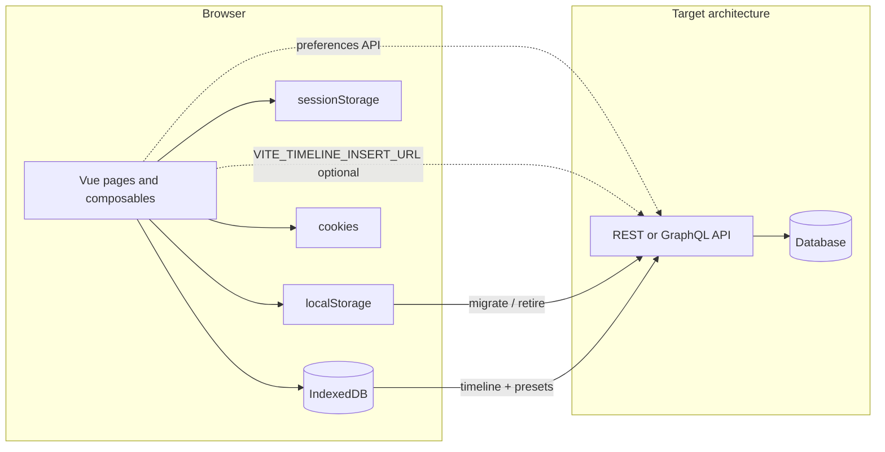

# Client persistence inventory (for DB migration)

Reference for developers replacing browser-only persistence with a **database + API**, and for related client persistence (cookies, IndexedDB) and **chat / Twilio MMS attachments** (Appendix D).

---

## Purpose

This document lists **where the Customer Care frontend persists data in the browser**, with **exact keys / database names**, **source files**, and **which API is authoritative today**. Use it when replacing client-only persistence with server-backed storage.

**Scope:** `src/` (Vue app), plus [`sms-server.js`](../sms-server.js) for chat attachment disk storage (Appendix D). Searched with:

`rg "localStorage|sessionStorage|indexedDB|document\.cookie" src --glob "*.{ts,vue}"`

**Not server-persisted in this repo (but related):**

- **Dev identity** — [`src/composables/useDevUserContext.ts`](../src/composables/useDevUserContext.ts) fetches [`public/dev-user-context.json`](../public/dev-user-context.json) in `import.meta.env.DEV` only; held in memory, not `localStorage`.
- **Tickets cookies** — [`src/composables/useSessionCookie.ts`](../src/composables/useSessionCookie.ts) (Appendix A); overlap with [`user_ticket_preferences`](../src/api/userPreferences.ts).
- **Chat attachments** — in-memory in Vue until upload; files on disk via Node (Appendix D).

---

## Storage mechanisms (summary)

| Mechanism | Primary use in this app | Init / entry |
|-----------|-------------------------|--------------|
| **localStorage** | Appointments cache, ticket prefs, UI dismissals, theme, store #, KPI caches, host identity/permissions | Many modules; see sections below |
| **sessionStorage** | Welcome-modal snooze (tickets); cleared on sign-out with identity keys | [`src/lib/tickets-onboarding.ts`](../src/lib/tickets-onboarding.ts), [`src/composables/useStoreContext.ts`](../src/composables/useStoreContext.ts) |
| **IndexedDB** | Timeline events (send/view/status/approval) and filter presets (global/local) | [`src/lib/timelineIndexedDb.ts`](../src/lib/timelineIndexedDb.ts), [`src/lib/ticketPresetIndexedDb.ts`](../src/lib/ticketPresetIndexedDb.ts); timeline init in [`src/main.ts`](../src/main.ts) |
| **Cookies** | Tickets date range, view mode, active preset id | [`src/pages/TicketsPage.vue`](../src/pages/TicketsPage.vue) via `useSessionCookie` |
| **In-memory** | Dev user context; timeline/preset IDB read caches; pending chat files | Composables / components |
| **Server disk** | Twilio MMS media (ephemeral) | [`sms-server.js`](../sms-server.js) |

---

## How to read this doc

- **DB candidate:** Business or cross-device data; today only exists on one browser (or one browser profile).
- **Client-only (typical):** Theme, onboarding flags, ephemeral UI dismissals—often **not** worth storing in your primary DB (optional user settings table is enough).
- **Injected by host / auth:** Keys read for permissions or identity may already be set by PHP or another shell; DB work may mean **replacing** these with real session claims, not duplicating them in localStorage.
- **IndexedDB (interim):** Timeline and presets are structured for a future SQL/API migration; see [`docs/IMPLEMENTATION.md`](IMPLEMENTATION.md) for target tables and routes.

---

## 1. Appointments and rescheduling

| Key(s) | Module / consumers | What is stored | DB notes |
|--------|-------------------|----------------|----------|
| `appointment_requests` | [`src/api/appointments.ts`](../src/api/appointments.ts); read in [`src/pages/AppointmentReschedulePage.vue`](../src/pages/AppointmentReschedulePage.vue) | JSON array of appointment request objects; written on create/update; API fallback | **Strong DB candidate:** primary store should be server-side; localStorage is fallback/cache today. |
| `appointment_reschedule_tokens` (`RESCHEDULE_STORAGE_KEY`) | [`src/api/appointments.ts`](../src/api/appointments.ts); [`src/pages/AppointmentsDashboardPage.vue`](../src/pages/AppointmentsDashboardPage.vue) | Map/object of reschedule token metadata (including time slots synced from dashboard) | **Strong DB candidate:** tokens and slot assignments must be authoritative on the server. |
| `hd_appointments_filters` | [`src/composables/useAppointmentFilters.ts`](../src/composables/useAppointmentFilters.ts) | Serialized appointment list filters | Optional user/shop setting or server defaults. |
| `hd_appointments_module_records` | [`src/api/appointments.ts`](../src/api/appointments.ts) | Appointment module configuration records (seeded if missing) | **DB candidate** when modules are shop-scoped. |
| `hd_appointments_color_defaults` | same | Default colors per module/category | Same. |
| `hd_appointments_color_overrides` | same | User/shop color overrides | Same. |
| `hd_appointments_ical_status` | same | Per-module iCal sync status map | Same. |
| `hd_appointments_shell_state` | [`src/pages/AppointmentsDashboardPage.vue`](../src/pages/AppointmentsDashboardPage.vue) | Dashboard shell UI state (layout/panel state JSON) | **Client-only** unless you want synced layout. |
| `hd_appointments_proposed_offers` | same | Proposed reschedule offers map | **Strong DB candidate** with appointments API. |

---

## 2. User ticket preferences (filters, columns, presets, style)

| Key(s) | Module / consumers | What is stored | DB notes |
|--------|-------------------|----------------|----------|
| `user_ticket_preferences` (`PREFS_STORAGE_KEY`) | [`src/api/userPreferences.ts`](../src/api/userPreferences.ts); [`src/composables/useUserPreferences.ts`](../src/composables/useUserPreferences.ts) | Full `UserTicketPreferences` JSON (filters, style, presets list metadata, column configs, etc.) | **Hybrid today:** `GET/PUT` [`/api/preferences/tickets`](../src/api/userPreferences.ts) with **localStorage as fallback/cache**. Make API authoritative; demote or remove localStorage. |

**Filter presets (IndexedDB):** Preset **bodies** for system/company/user scopes are also stored in IndexedDB (section 3b). [`useUserPreferences.ts`](../src/composables/useUserPreferences.ts) merges API/localStorage prefs with `listIndexedDbPresets` / `saveIndexedDbPreset` on load and CRUD.

---

## 3. Timeline, invoice/inspection journey, and work approvals (IndexedDB)

**Authoritative client store:** IndexedDB database `customer-care-timeline`, object store `timeline_events`, version **2**. Initialized at app boot via `initTimelineIndexedDb()` in [`src/main.ts`](../src/main.ts).

**Facade modules** (read/write through IDB, not direct `localStorage`):

| Module | Role |
|--------|------|
| [`src/lib/timelineIndexedDb.ts`](../src/lib/timelineIndexedDb.ts) | IDB schema, migration, in-memory caches, `timeline-idb-changed` events |
| [`src/lib/invoice-view-tracker.ts`](../src/lib/invoice-view-tracker.ts) | Invoice viewed/sent, vehicle status timeline |
| [`src/lib/inspection-view-tracker.ts`](../src/lib/inspection-view-tracker.ts) | Inspection viewed/sent |
| [`src/lib/work-approvals.ts`](../src/lib/work-approvals.ts) | Work approval records per ticket |

**Event types** (numeric `type` on rows; map to SQL labels in backend work):

| Type | Meaning |
|------|---------|
| 1 | Vehicle status change |
| 2 | Ticket/invoice sent |
| 3 | Invoice viewed |
| 4 | Work approval |
| 5 | Inspection sent |
| 6 | Inspection viewed |

**Cross-tab / same-tab UI:** `window` event `timeline-idb-changed` with `detail: { kind, ticketNumber }` (kinds include `invoice_view_status`, `ticket_sent`, `vehicle_status_changes`, `inspection_view_status`, `inspection_sent`, `work_approvals`). Listeners: [`src/pages/TicketsPage.vue`](../src/pages/TicketsPage.vue), [`src/pages/CustomerInvoiceView.vue`](../src/pages/CustomerInvoiceView.vue).

**Backend hook (partial):** [`src/api/timeline.ts`](../src/api/timeline.ts) `persistTimelineEvent` POSTs when `VITE_TIMELINE_INSERT_URL` is set; otherwise no-op while IDB remains source of truth for the UI.

**Consumers:** [`src/composables/useTicketTimelineData.ts`](../src/composables/useTicketTimelineData.ts), ticket list/progress UI, [`src/components/tickets/TicketActionsDrawer.vue`](../src/components/tickets/TicketActionsDrawer.vue), [`src/components/tickets/ApprovedServicesPanel.vue`](../src/components/tickets/ApprovedServicesPanel.vue), [`src/utils/ticketStatus.ts`](../src/utils/ticketStatus.ts).

### 3a. Legacy localStorage (one-time migration)

On first IDB init, [`migrateLocalStorageAndLegacyStores`](../src/lib/timelineIndexedDb.ts) imports legacy keys into `timeline_events`, then sets:

| Key | Purpose |
|-----|---------|
| `timeline_idb_schema_v2_migrated` | `'1'` after migration completes |

**Legacy key patterns migrated into IDB** (no longer written by tracker code):

| Pattern | Former purpose |
|---------|----------------|
| `vehicle_status_changes_{ticketNumber}` | Vehicle status timeline |
| `ticket_sent_{ticketNumber}` | Send events |
| `invoice_view_status_{ticketNumber}` | Invoice viewed state |
| `inspection_sent_{ticketNumber}` | Inspection send events |
| `inspection_view_status_{ticketNumber}` | Inspection viewed state |
| `work_approvals_v1` | Map of ticket → approval record |

**Still read (not migrated):**

| Key | Module | Purpose |
|-----|--------|---------|
| `invoice_view_{token}` | [`src/pages/CustomerInvoiceView.vue`](../src/pages/CustomerInvoiceView.vue) | Legacy share-token blob; prefer server token resolution |

### 3b. Filter presets (IndexedDB)

| Setting | Value |
|---------|--------|
| Database | `customer-care-presets` (version **1**) |
| Stores | `ticket_presets_global` (ids **0–999**), `ticket_presets_local` (ids **1000–99999**) |
| Module | [`src/lib/ticketPresetIndexedDb.ts`](../src/lib/ticketPresetIndexedDb.ts) |
| Wired from | [`src/composables/useUserPreferences.ts`](../src/composables/useUserPreferences.ts) (`bootstrapIndexedDbPresets`, `saveIndexedDbPreset`, etc.) |

Preset **Type** in IDB: `1` system, `2` company, `3` user. Target server API described in [`docs/IMPLEMENTATION.md`](IMPLEMENTATION.md).

---

## 4. Ticket list UI: computed fields and “flash” dismissals

| Key pattern | Module | Purpose | DB notes |
|-------------|--------|---------|----------|
| `ticket_last_type_{ticketNumber}` | [`src/composables/useTicketComputedFields.ts`](../src/composables/useTicketComputedFields.ts) | Last observed ticket type (`W` / `I`) | **Usually client-only** (derived cache for KPI math). |
| `ticket_type_transition_to_invoice_{ticketNumber}` | same | Timestamp (ms) of transition to invoice | Same. |
| `ticket_first_invoice_observed_{ticketNumber}` | same | First time type `I` seen | Same. |
| `ticket_first_workorder_observed_{ticketNumber}` | same | First time type `W` seen | Same. |
| `view_button_flash_dismissals_v1` | [`src/composables/useViewButtonState.ts`](../src/composables/useViewButtonState.ts) | Map ticket → dismissal version key | **Client-only** (UX). |
| `inspection_button_flash_dismissals_v1` | [`src/composables/useInspectionViewButtonState.ts`](../src/composables/useInspectionViewButtonState.ts) | Same for inspection button | **Client-only.** |
| `timeline_approval_flash_dismissals_v1` | [`src/composables/useApprovalsActionButtonState.ts`](../src/composables/useApprovalsActionButtonState.ts) | Map ticket → approval version key | **Client-only.** |

---

## 5. Tickets mobile layout overrides

| Key | Module | Purpose | DB notes |
|-----|--------|---------|----------|
| `tickets_mobile_table_override` | [`src/lib/mobile-ticket-style.ts`](../src/lib/mobile-ticket-style.ts), [`src/pages/TicketsPage.vue`](../src/pages/TicketsPage.vue) | User chose table on narrow viewport | **Optional user setting** (preferences API). |
| `tickets_mobile_table_not_optimized_dismissed` | same | “Not optimized” banner dismissed | **Client-only** (UX). |

---

## 6. Onboarding / welcome (tickets)

| Key | Storage | Module | Purpose | DB notes |
|-----|---------|--------|---------|----------|
| `customer-care:tickets-onboarding-v1` | localStorage | [`src/lib/tickets-onboarding.ts`](../src/lib/tickets-onboarding.ts) | Main tour: `skipped` / `completed` | **Usually client-only**. |
| `customer-care:tickets-onboarding-advanced-v1` | localStorage | same | Advanced tour state | Same. |
| `customer-care:tickets-onboarding-preset-builder-v1` | localStorage | same | Preset-builder tour state | Same. |
| `customer-care:tickets-welcome-snoozed-session-v1` | **sessionStorage** | same | Snooze welcome modal for current tab session | **Session-only by design**. |

---

## 7. Theme

| Key | Module | Purpose | DB notes |
|-----|--------|---------|----------|
| `customer-care-theme` | [`src/composables/useColorMode.ts`](../src/composables/useColorMode.ts) | Light / dark / system | **Client-only** unless synced theme on user profile. |

---

## 8. Store context

| Key | Module | Purpose | DB notes |
|-----|--------|---------|----------|
| `customer_care_selected_store_num` | [`src/composables/useStoreContext.ts`](../src/composables/useStoreContext.ts) | Selected shop/store number for dev/temp multi-store UI | **DB candidate** when stores come from API; today hard-coded options with persisted selection. |

---

## 9. Permissions and identity (read from localStorage)

| Key | Module | Purpose | DB notes |
|-----|--------|---------|----------|
| `permission_cost` | [`src/composables/usePermissions.ts`](../src/composables/usePermissions.ts) | Boolean-ish gate for cost / view totals | **Replace with server authorization.** |
| `permission_Chat` | same | Chat permission | Same. |
| `HDN1` | same | Must be `'1'`, `'4'`, or `'6'` with `permission_Chat` for SMS/chat in prod | Same. |
| `HDN2` | same; DEV override via [`useDevUserContext.ts`](../src/composables/useDevUserContext.ts) | `'1'` hides price/cost/total/GP% in staff tickets UI | Same. |
| `current_user`, `user_name` | TicketsPage, TopNav, CustomerInvoiceView, useUserPreferences | Display name fallback | **Session / identity service**; not app-writable persistence. |
| `role_ID` | TicketsPage, useUserPreferences | Role id string | Same. |
| `customer_ID` | useUserPreferences | Customer scope | Same. |
| `advisor_logged_in` | [`src/pages/CustomerInvoiceView.vue`](../src/pages/CustomerInvoiceView.vue) | Read `'true'` for advisor session | **No `setItem` in this repo**—likely set by host app. |

**Sign-out** ([`useStoreContext.ts`](../src/composables/useStoreContext.ts)): `signOutToRoot` / `signOutAndClearPasswordToRoot` remove identity/permission keys from **localStorage and sessionStorage**, scan both storages for password-like keys, and clear matching **cookies**.

---

## 10. High-level data flow (what to replace)



---

## Appendix A — Tickets page cookies (not localStorage)

Via [`useSessionCookie`](../src/composables/useSessionCookie.ts) in [`src/pages/TicketsPage.vue`](../src/pages/TicketsPage.vue):

| Cookie name | Purpose | Lifetime |
|-------------|---------|----------|
| `tickets_date_range` | Date filter preset | Session cookie (no `max-age`) |
| `tickets_custom_from_date` | Custom range start | Session |
| `tickets_custom_to_date` | Custom range end | Session |
| `tickets_view_mode` | `card` \| `table` \| `progress` | Session |
| `tickets_active_preset_id` | Last active filter preset id | `max-age` until next local 3:00 AM |

These duplicate some concerns with **user preferences** and **IndexedDB presets**; prefer one persistence strategy (DB-backed preferences + short-lived cookies only where needed).

---

## Appendix B — Sign-out and password cleanup

[`signOutToRoot`](../src/composables/useStoreContext.ts) clears session identity keys in localStorage/sessionStorage and redirects to `/`.

[`signOutAndClearPasswordToRoot`](../src/composables/useStoreContext.ts) also removes keys matching `/pass|pwd|remember/i` from both storages and expires matching cookies.

Explicit key list cleared: `current_user`, `user_name`, `role_ID`, `customer_ID`, `advisor_logged_in`, `permission_cost`, `permission_Chat`, `HDN1`, `HDN2`.

---

## Appendix C — Files touched as readers / integration points

- [`src/api/timeline.ts`](../src/api/timeline.ts) — optional server persist; IDB via `saveTimelineEventLocal`.
- [`src/lib/invoice-view-tracker.ts`](../src/lib/invoice-view-tracker.ts), [`src/lib/inspection-view-tracker.ts`](../src/lib/inspection-view-tracker.ts), [`src/lib/work-approvals.ts`](../src/lib/work-approvals.ts) — timeline facades.
- Ticket tour/demo code may avoid mutating real storage ([`src/lib/tickets-tour-demo.ts`](../src/lib/tickets-tour-demo.ts)).

**Tests:** [`tests/timeline-indexeddb.test.ts`](../tests/timeline-indexeddb.test.ts), [`tests/ticket-preset-indexeddb.test.ts`](../tests/ticket-preset-indexeddb.test.ts), [`tests/hdn1-permissions.test.ts`](../tests/hdn1-permissions.test.ts), [`tests/hdn2-permissions.test.ts`](../tests/hdn2-permissions.test.ts).

---

## Appendix D — Chat / Twilio MMS and email attachments (not browser storage)

Outbound attachments are implemented in **[`sms-server.js`](../sms-server.js)** (Express + Twilio + multer) and the Vue chat UI. **Nothing is written to `localStorage` / IndexedDB for files**; the browser keeps pending files in memory/refs until send.

### Client (Vue)

| Area | File | Role |
|------|------|------|
| Picker + validation + UX (MMS vs email limits, PDF warning) | [`src/components/chat/ChatPanelBody.vue`](../src/components/chat/ChatPanelBody.vue) | `pendingAttachments`, size/MIME checks, `uploadChatAttachments` before SMS send |
| Policy constants (aligned with server) | [`src/lib/chat-attachment-policy.ts`](../src/lib/chat-attachment-policy.ts) | Allowlist: JPEG, PNG, GIF, PDF; MMS **5 MB total** (body + files), up to **10** files; email **25 MB** total |
| API | [`src/api/chat.ts`](../src/api/chat.ts) | `uploadChatAttachments` → `POST .../chat/attachments`; `sendChatMessage` forwards `mediaUrls`; `sendChatEmail` sends multipart |

### Server (`sms-server.js`)

| Topic | Detail |
|-------|--------|
| **Upload** | `POST /chat/attachments` — multer **disk** storage; MIME allowlist; combined MMS ≤ 5 MB; returns `{ mediaUrl }` under **`PUBLIC_MEDIA_BASE_URL`**. |
| **SMS/MMS send** | `POST /chat/send` — `mediaUrl` array; total text + media ≤ 5 MB. |
| **Email** | Multipart route; **25 MB** combined limit. |
| **Lifecycle** | `pendingMmsMediaBySid`; **`POST /sms-status-callback`** deletes disk files on **delivered** when **`TWILIO_STATUS_CALLBACK_URL`** is configured. |

### Database / durable storage migration notes

Today, MMS files are **ephemeral on disk**. For retained history/audits, plan object storage + DB rows linking ticket, `MessageSid`, filename, mime, size, storage key, and retention policy.

---

## Suggested migration priorities

1. **Appointments** and **reschedule tokens** — authoritative server data and security.
2. **Timeline** (IndexedDB + optional `VITE_TIMELINE_INSERT_URL`) and **work approvals** — compliance and cross-device truth.
3. **Filter presets** (IndexedDB + preferences API) — global/local preset APIs per IMPLEMENTATION.md.
4. **User ticket preferences** — make preferences API authoritative; reduce localStorage fallback.

---

## Verification commands (for future edits)

From repo root:

```bash
rg "localStorage|sessionStorage|indexedDB|document\.cookie" src --glob "*.{ts,vue}"
```

IndexedDB modules:

```bash
rg "timelineIndexedDb|ticketPresetIndexedDb|timeline-idb-changed" src --glob "*.{ts,vue}"
```

Attachments / Twilio:

```bash
rg "attachments|mediaUrl|/chat/attachments" src sms-server.js --glob "*.{ts,vue,js}"
```

---

**Assumptions:** Inventory reflects the workspace at authoring time. PHP or other apps may set additional keys at runtime (`advisor_logged_in`, permission keys) that are not visible in this Vue codebase. Legacy timeline keys may still exist in older browsers until `timeline_idb_schema_v2_migrated` is set.
